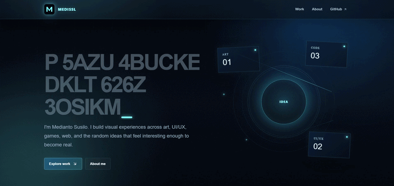
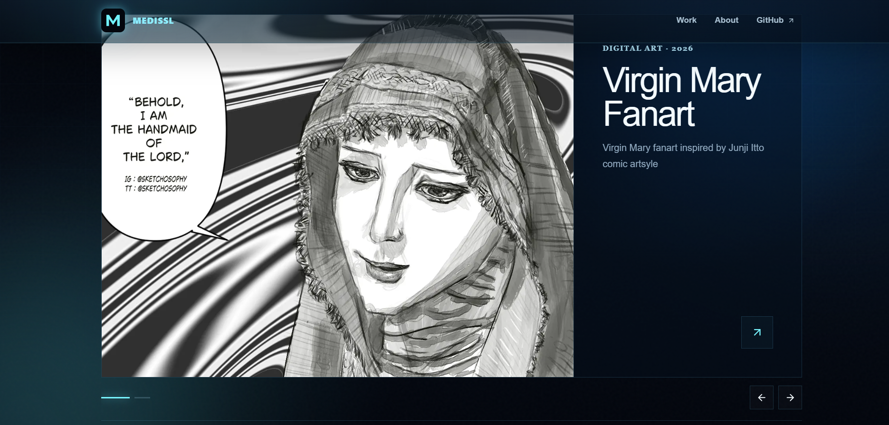
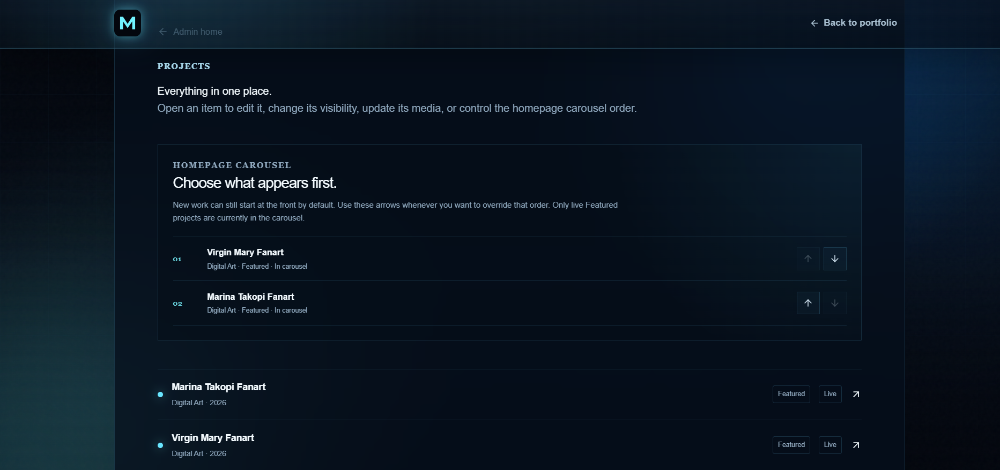

# Medissl — Creative Portfolio

A live creative portfolio and lightweight CMS for my art, UI/UX, interactive media, games, web work, and the random ideas that feel interesting enough to become real.

**Live site:** [medissl-portfolio.vercel.app](https://medissl-portfolio.vercel.app)

## Preview



<table>
  <tr>
    <td width="50%">
      
      <br />
      <sub><b>Public portfolio</b> — featured artwork carousel</sub>
    </td>
    <td width="50%">
      
      <br />
      <sub><b>Private CMS</b> — manual carousel ordering</sub>
    </td>
  </tr>
</table>

## Why I built it

I wanted the portfolio itself to be part of the portfolio.

Instead of making a static gallery that I would have to keep rebuilding, I made a small publishing system that can grow with my work. The public side focuses on presentation and interaction, while the private admin side handles the repetitive work of adding projects, uploading media, publishing drafts, and deciding what gets featured.

The result is one project serving two purposes: a personal creative portfolio and a CMS I can actually keep using.

## What it does

### Public portfolio

- Dark / electric-blue visual system
- Animated multilingual hero headline
- Interactive hero graphic and motion effects
- Featured-work carousel
- Art and project archive with category filters
- Dynamic project detail pages
- Finished-work, gallery, and process-image sections
- Responsive layouts for desktop, tablet, and mobile
- Reduced-motion support
- Accessible navigation and metadata for sharing/search

### Private CMS

- Email/password admin authentication
- No public sign-up flow
- Create and edit portfolio projects
- Upload cover, gallery, and process images directly to Supabase Storage
- Draft / publish workflow
- Public visibility controls
- Featured-project controls
- Manual homepage carousel ordering
- Browser persistence for unsaved form data and selected files
- Project and media deletion
- Row Level Security protecting project and media writes

## Stack

- **Framework:** Next.js 16 · App Router · React 19
- **Language:** TypeScript
- **Styling:** Tailwind CSS + custom CSS
- **Motion:** Motion
- **Database:** Supabase Postgres
- **Authentication:** Supabase Auth
- **Media:** Supabase Storage
- **Hosting:** Vercel
- **CI:** GitHub Actions

## Architecture

The public pages read published portfolio data from Supabase and render it through Next.js.

The admin interface authenticates with Supabase Auth. Being able to see or modify the client-side admin code does **not** grant write access: database mutations are protected by Supabase Row Level Security, and admin writes are restricted to authenticated users registered in `public.admin_users`.

The frontend uses a Supabase **publishable key**, which is intended for browser use. Secret/service-role keys are never required by the client and should never be committed to the repository.

## Project structure

```text
src/
├─ app/
│  ├─ admin/              # Private CMS routes
│  ├─ work/               # Portfolio archive + project routes
│  └─ page.tsx            # Homepage
├─ components/            # Hero, carousel, CMS editor, UI sections
└─ lib/                   # Supabase, project queries, types, draft storage

supabase/
└─ migrations/            # Database schema and RLS changes

docs/
└─ screenshots/           # README previews
```

## Local development

```bash
npm install
npm run dev
```

The repository includes the public Supabase project URL and publishable key as browser-safe fallbacks. They can be overridden locally:

```env
NEXT_PUBLIC_SUPABASE_URL=...
NEXT_PUBLIC_SUPABASE_PUBLISHABLE_KEY=...
```

Never put a Supabase secret or service-role key in a `NEXT_PUBLIC_*` variable.

## First admin setup

The CMS deliberately has no public registration button.

1. Create the portfolio owner's Auth user in the Supabase dashboard.
2. Copy the user's UUID.
3. Add that UUID to `public.admin_users`:

```sql
insert into public.admin_users (user_id)
values ('YOUR_AUTH_USER_UUID');
```

After that, sign in through `/admin`.

## Database migrations

- `001_initial_portfolio_schema.sql` — projects, media, storage, indexes, and initial RLS
- `002_harden_rls_policies.sql` — security-policy hardening
- `003_add_carousel_order.sql` — manual homepage carousel ordering

The live Supabase project is kept aligned with the migrations in `supabase/migrations/`.

## Deployment

Pushes to `main` run the repository's lint/build workflow through GitHub Actions and trigger a Vercel deployment.

**Production:** [medissl-portfolio.vercel.app](https://medissl-portfolio.vercel.app)

---

Built and maintained by **Medianto Susilo**.
